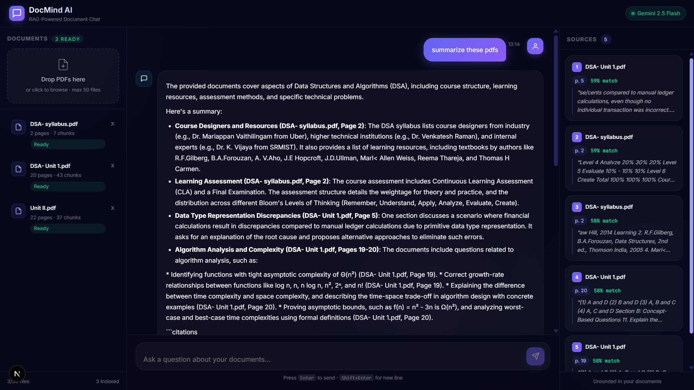
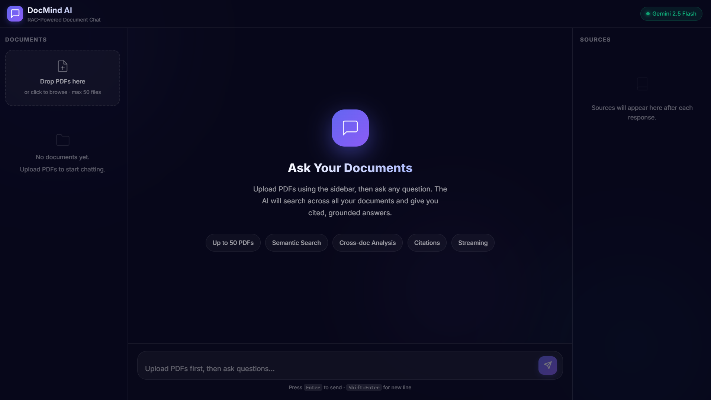
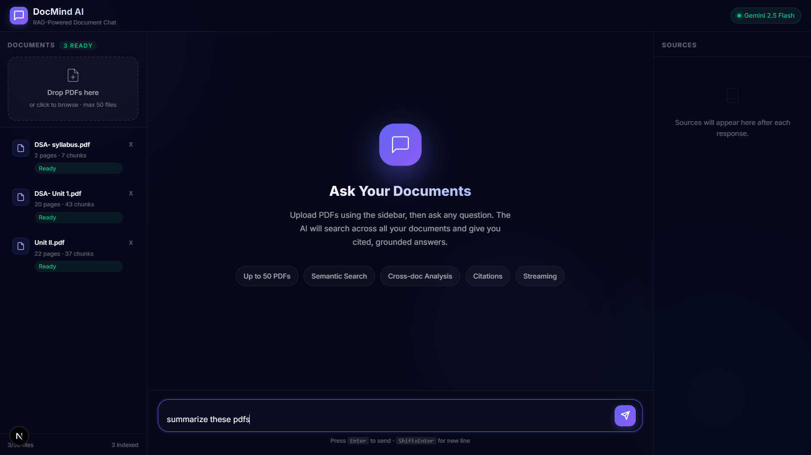

# DocMind AI

**DocMind AI** is a full-stack **Retrieval-Augmented Generation (RAG) chatbot** built with Next.js. Upload PDF documents and ask natural-language questions — powered by Google Gemini embeddings, Pinecone vector search, and streaming responses with source citations.

### 🚀 Live Deployment
**[View the Live App on Vercel](https://pdfsummary-c67ajhv90-tamoghnodebs-projects.vercel.app)**

### 💻 Source Code
**[GitHub Repository](https://github.com/tamoghnodeb/pdfsummary)**

---

## 📸 Screenshots & Demo

<div align="center">

### 1. Document Chat & Grounded Responses with Real-time Citations


<br/>

### 2. PDF Processing & Multi-Document Semantic Search
<p float="left">
  
  
</p>

</div>

---

## Architecture Diagram

The application leverages a modern Serverless architecture to ingest, process, and query documents in real-time.

```text
                          ┌───────────────────────────────┐
                          │        Next.js 16 (Vercel)    │
                          │                               │
                          │  /chat   /api/upload          │
                          │          /api/process         │
                          │          /api/chat            │
                          └──────────────┬────────────────┘
                                         │
               ┌─────────────────────────┼─────────────────────────┐
               ▼                         ▼                         ▼
  ┌────────────────────┐    ┌─────────────────────┐    ┌───────────────────┐
  │   Google Gemini    │    │  Pinecone Serverless │    │   Browser Client  │
  │                    │    │                     │    │                   │
  │  gemini-embedding  │    │  768-dim cosine      │    │  React + SSE      │
  │  -001 (embeddings) │    │  vector index        │    │  streaming reader │
  │                    │    │  + metadata filters  │    │                   │
  │  gemini-2.5-flash  │    │  (session isolation) │    │  Citation panel   │
  │  (chat + stream)   │    │                     │    │  Document sidebar  │
  └────────────────────┘    └─────────────────────┘    └───────────────────┘
```

**Upload flow:**
```text
Browser → POST /api/upload (base64) → /api/process →
  pdf-parse (text extraction) → chunking → Gemini embed → Pinecone upsert
```

**Query flow:**
```text
User query → Gemini embed query → Pinecone top-5 → context string →
  Gemini 2.5 Flash stream → SSE to browser → citations rendered
```

---

## Features

| Feature | Details |
|:---|:---|
| **Multi-PDF Upload** | Up to 50 PDFs per session via drag-and-drop |
| **Semantic Search** | Gemini `gemini-embedding-001` (768-dim) + Pinecone vector search |
| **Grounded Answers** | Gemini 2.5 Flash — answers strictly from your documents |
| **Source Citations** | Every answer includes filename and page number |
| **Streaming** | Token-by-token output via Server-Sent Events |
| **Deduplication** | SHA-256 hash check — never re-embeds the same file twice |
| **Conversation Memory** | Follow-up questions retain context from the session |
| **Responsive UI** | Dark glassmorphism design — works on desktop and mobile |

---

## Quick Start

### Prerequisites

- Node.js 20+
- Accounts at [Google AI Studio](https://aistudio.google.com), [Pinecone](https://app.pinecone.io)

### 1. Clone & install

```bash
git clone https://github.com/tamoghnodeb/pdfsummary.git
cd pdfsummary
npm install
```

### 2. Configure environment

```bash
cp .env.example .env.local
```

Open `.env.local` and fill in your API keys.

### 3. Run locally

```bash
npm run dev
```

Open [http://localhost:3000](http://localhost:3000). The app will automatically redirect to the chat interface.

---

## Deploy to Vercel

[](https://vercel.com/new/clone?repository-url=https://github.com/tamoghnodeb/pdfsummary)

1. Import your repository into Vercel.
2. Under **Environment Variables**, add:
   - `GEMINI_API_KEY`
   - `PINECONE_API_KEY`
   - `PINECONE_INDEX_NAME`
3. Click **Deploy**.

> **Note:** Ensure Vercel Authentication (Deployment Protection) is disabled if you want the app to be publicly accessible.

---

## Environment Variables

| Variable | Description | Required |
|:---|:---|:---:|
| `GEMINI_API_KEY` | Google AI Studio API key | ✓ |
| `PINECONE_API_KEY` | Pinecone API key | ✓ |
| `PINECONE_INDEX_NAME` | Name of your Pinecone index | ✓ |

### Setting up services

<details>
<summary><strong>Google Gemini</strong> (free)</summary>

1. Go to [aistudio.google.com/app/apikey](https://aistudio.google.com/app/apikey)
2. Click **Create API key**
3. Copy the key into `GEMINI_API_KEY`

</details>

<details>
<summary><strong>Pinecone</strong> (free tier available)</summary>

1. Sign up at [app.pinecone.io](https://app.pinecone.io)
2. Create a new **Serverless** index:
   - **Dimensions:** `768`
   - **Metric:** `cosine`
   - **Cloud:** AWS · **Region:** us-east-1
3. Copy your API key into `PINECONE_API_KEY`
4. Set `PINECONE_INDEX_NAME` to your index name

</details>

---

## Project Structure

```
pdfsummary/
├── app/
│   ├── api/
│   │   ├── upload/               # PDF ingestion endpoint
│   │   ├── process/              # Text extraction → embed → Pinecone
│   │   ├── chat/                 # SSE streaming RAG endpoint
│   │   └── documents/            # List / delete indexed documents
│   ├── chat/page.tsx             # Main chat interface
│   ├── layout.tsx                # Root layout
│   └── globals.css               # Design system (glassmorphism)
├── components/
│   ├── ChatInterface.tsx         # Main orchestrator component
│   ├── DocumentSidebar.tsx       # Upload zone + document list
│   ├── MessageBubble.tsx         # Chat message renderer
│   └── CitationPanel.tsx         # Source citation display
├── lib/
│   ├── gemini.ts                 # Gemini embeddings + chat
│   ├── pinecone.ts               # Vector DB read/write
│   ├── pdf-processor.ts          # PDF text extraction + chunking
│   └── utils.ts                  # Shared utilities
├── types/index.ts                # TypeScript type definitions
└── .env.example                  # Environment variable template
```

---

## Tech Stack

| Layer | Technology |
|:---|:---|
| Framework | Next.js 16 (App Router, Turbopack) |
| Language | TypeScript |
| LLM | Google Gemini 2.5 Flash |
| Embeddings | Gemini `gemini-embedding-001` (768-dim) |
| Vector DB | Pinecone Serverless |
| PDF Parsing | pdf-parse (server-side) |
| Styling | Vanilla CSS — dark glassmorphism |
| Deployment | Vercel |

---

## License

MIT — free for personal and educational use.
